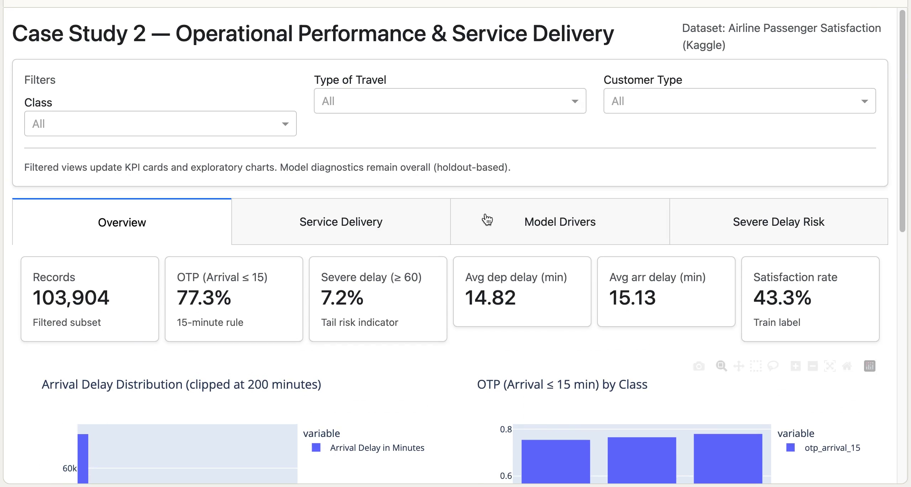

# Case Study 2 — Operational Performance & Service Delivery (OTP, Delay, Anomalies, KPI Monitoring)

This portfolio case study demonstrates an end-to-end workflow for **operational reliability** and **service delivery** analytics using the Kaggle *Airline Passenger Satisfaction* dataset.  
The analysis focuses on KPI monitoring (OTP and delay metrics), segment diagnostics, anomaly detection, interpretable drivers of satisfaction, and leakage-aware severe-delay risk scoring.

---

## Contents

- **Notebook (analysis + modeling):** `OTP_ServiceDelivery_Kaggle_AirlinePassengerSatisfaction.ipynb`
- **Dashboard (Plotly Dash):** `app.py` + `requirements.txt` + `README_DASH.md`

Recommended repo layout:

```
Case Study 2 — Operational Performance & Service Delivery (OTP, delay, anomalies, KPI monitoring)/
  README.md
  OTP_ServiceDelivery_Kaggle_AirlinePassengerSatisfaction.ipynb
  app.py
  requirements.txt
  README_DASH.md
  train.csv
  test.csv
  assets/
    Screen Recording 2026-01-18 at 14.52.04.mov
```

---

## Dataset

- Source: **Kaggle — Airline Passenger Satisfaction**
- Records (train): **103,904**
- Features: passenger/trip context, service ratings, departure/arrival delay minutes
- Target: `satisfaction` (binary: `satisfied` vs `neutral or dissatisfied`)
- Note: `test.csv` contains `satisfaction` in this split, enabling holdout evaluation.

---

## Key results (from notebook outputs)

### Operational performance KPIs (train)
- **OTP (Arrival ≤ 15 min): ~77.3%**
- **Average departure delay: ~14.82 minutes**
- **Average arrival delay: ~15.13 minutes**
- **Severe delay (Arrival ≥ 60 min): ~7.2%**
- **Satisfaction rate: ~43.3%**

Delay minutes show a **right-skewed distribution**: most observations cluster near on-time performance while a small tail drives major disruptions.

### Segment diagnostics (tail-risk)
- Median arrival delay is **0 minutes** across major segments, so differences appear primarily in the **upper tail** (p90 delay and severe-delay rate).
- Interaction view (**Class × Type of Travel**) surfaces higher tail risk:
  - **Eco / Business travel** and **Eco Plus / Business travel** show higher p90 (~50 minutes) and lower OTP (~0.75) compared to other combinations.

### Service delivery (experience gaps)
Largest rating gaps between **satisfied** and **neutral/dissatisfied** groups:
- **Online boarding: +1.37**
- **Inflight entertainment: +1.07**
- **Seat comfort: +0.93**
Followed by on-board service, leg room service, cleanliness, and inflight wifi.

### Satisfaction modeling (holdout)
Models are trained on `train.csv` and evaluated on the labeled `test.csv` holdout.
- **Random Forest:** Accuracy **~0.965**, ROC-AUC **~0.994**
- **Logistic Regression:** Accuracy **~0.873**, ROC-AUC **~0.927**

Confusion matrix (Random Forest, threshold 0.50):
- TN: 14,283 | FP: 290 | FN: 622 | TP: 10,781

### Driver ranking (permutation importance, ROC-AUC drop)
Top raw-feature drivers:
- **Type of Travel**
- **Inflight wifi service**
- **Customer Type**
- **Online boarding**
- **Class**
followed by check-in, seat comfort, baggage handling, inflight service, and cleanliness.

Operational delay fields show lower incremental lift once service ratings and travel context are included.

### Severe-delay risk scoring (leakage-aware)
Target: `severe_delay_60` (Arrival delay ≥ 60 minutes).  
Leakage note: the label is derived from arrival delay; including `Arrival Delay in Minutes` as a feature is unrealistic.

Two variants are demonstrated:
- **Variant A (pre-flight proxy; no delay minutes):** ROC-AUC **~0.571** (weak discrimination; majority-class dominance)
- **Variant B (at-gate/in-flight proxy; departure delay known; arrival delay excluded):** ROC-AUC **~0.985** with class-1 recall **~0.826** at threshold 0.50

---

## How to run — Notebook

### Option A: Jupyter (conda)
```bash
conda create -n otp_case_study python=3.11 -y
conda activate otp_case_study
pip install -r requirements.txt
jupyter lab
```

Open:
- `OTP_ServiceDelivery_Kaggle_AirlinePassengerSatisfaction.ipynb`

---

## How to run — Dashboard (Plotly Dash)

Place `train.csv` and `test.csv` in the same folder as `app.py`.

```bash
conda activate otp_case_study   # or an existing environment
pip install -r requirements.txt
python app.py
```

Open:
- http://127.0.0.1:8050

Optional:
```bash
PORT=8060 python app.py
```

### Performance tuning (Model Drivers tab)
Permutation importance is computed lazily when the **Model Drivers** tab is opened.  
To reduce compute time further:

```bash
PI_SAMPLE=3000 PI_REPEATS=2 PI_NJOBS=1 python app.py
```

---

## Demo
link video demo: https://raw.githubusercontent.com/barata90/case-study-2-otp-service-delivery/main/assets/demo_small.mp4


If playback does not start in the browser, open the link and download the MP4.

---

## Notes on interpretation
This dataset includes passenger service ratings that are typically collected via surveys. In real deployments, feature availability depends on when predictions are needed (pre-flight vs at-gate vs post-flight). The notebook includes explicit leakage-aware variants for the severe-delay task.

---

## Acknowledgements
- Kaggle dataset: *Airline Passenger Satisfaction*
- Libraries: pandas, scikit-learn, plotly, dash
